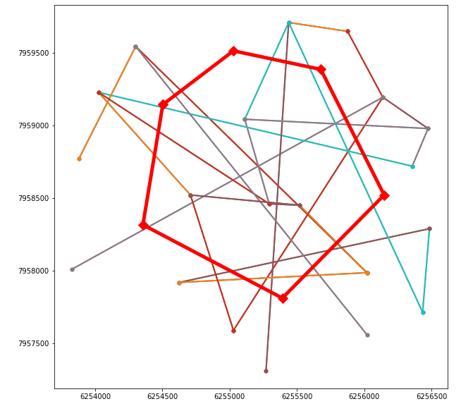

# Подсчет суммы длин частей отрезков, находящихся внутри заданного многоугольника

### Входные данные

1. [Координаты вершин многоугольника](src/Polygon.Console/table1.csv)
2. [Координаты начала и конца отрезков](src/Polygon.Console/table2.csv)

*Визуализация входных данных*

### Алгоритм решения

Для каждого отрезка проверяем, находятся ли его концы внутри многоугольника. Здесь может быть 4 случая:
* Обе точки внутри: берем длину всего отрезка
* Одна из точек внутри: берем длину отрезка, находящегося внутри
* Обе точки вне многоугольника, но часть отрезка пересекает его: берем длину отрезка, находящегося внутри
* Отрезок не пересекается с многоугольником

Алгоритм проверки принадлежности точки многоугольнику был взят (с некоторыми исправлениями) отсюда: [https://cp-algorithms.com/geometry/point-in-convex-polygon.html](https://cp-algorithms.com/geometry/point-in-convex-polygon.html)

### Требования к запуску
Для настройки и запуска приложения требуются:

 * .NET Core 3.1

 ### Запуск

 1. Откройте папку ["Polygon.Console"](src/Polygon.Console) в терминале и выполните команду:
 `dotnet run -c Release` 

### Тестирование

 1. Откройте папку ["src"](src/) в терминале и выполните команду:
 `dotnet test` 
